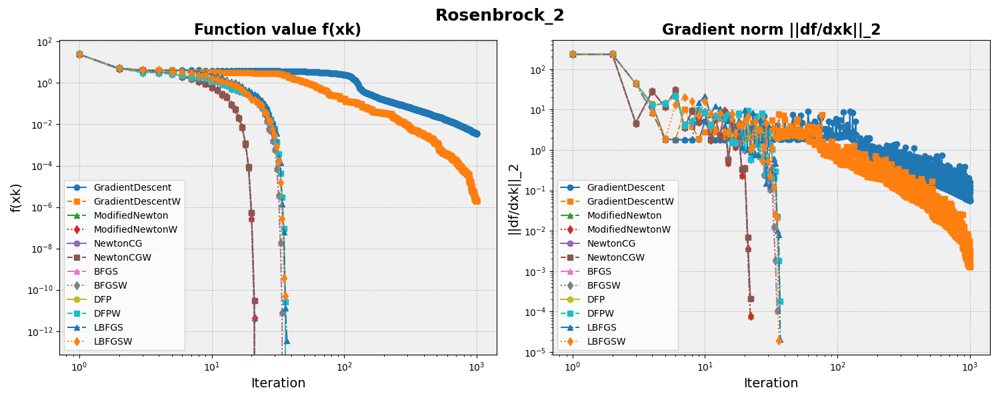
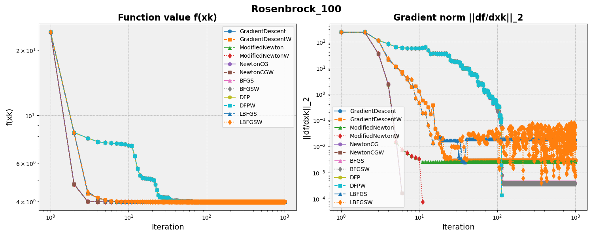

# NumericalOptimizationAlgorithms

Implementation of nonlinear programming algorithms based on the book [Numerical Optimization](https://link.springer.com/book/10.1007/978-0-387-40065-5). 

Authors: [Xinjie Liu](https://xinjie-liu.github.io/), [Kushagra Gupta](https://github.com/kaugsrha).

## How to Run

* Before running the script, please make sure all the dependencies are properly installed. Most likely you will need to install [JAX](https://jax.readthedocs.io/en/latest/notebooks/quickstart.html). 

* Run the demo script: `python runRosenbrock.py`, this will run 12 unconstrained optimization algorithms on Rosenbrock functions and generate the following plots:

## Content

The repository contains the following algorithms from [Numerical Optimization](https://link.springer.com/book/10.1007/978-0-387-40065-5):

### Line Search

* Armijo line search (Chapter 3)

* Wolfe line search (Chapter 3)

### Unconstrained Optimization

* Gradient descent (Chapter 2)

* Modified Newton's method (Chapter 3)

* Newton conjugate gradient (CG) method (Chapter 5)

* Quasi-Newton methods: BFGS, DFP, L-BFGS (limited memory version) (Chapters 6, 7)

### Constrained Optimization

* Active set method (Chapter 16): Note that the active set method is not yet integrated into the same API that the unconstrained optimization algorithms above use. Please call the `qp_solve` method of the `QPSolverActiveSet` class to run it.

## Acknowledgement

This repository is produced from taking the course Nonlinear Programming (ORI 391Q.1, 19100; CSE 393, 62294) by [Professor Raghu Bollapragada](https://sites.google.com/view/raghub/home) at The University of Texas at Austin. The authors thank him for the amazing lectures and discussions. 

